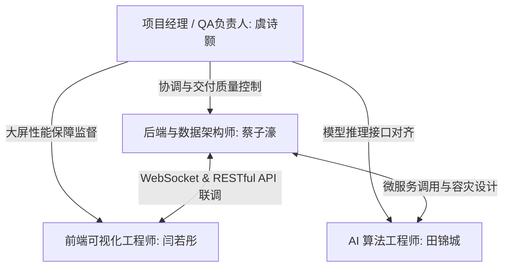

# AI 赋能企业供应链可视化分析系统 - 项目管理文档

本项目管理文档旨在规范“AI 赋能企业供应链可视化分析系统”的研发全周期。项目执行期为 1 个月，采用敏捷开发（Scrum）模式，通过合理的资源分配、明确的职责分工、严密的进度控制和多维度的风险评估，确保系统高质量、准时交付。

---

## 一、 项目计划制定

本系统是一个高度集成的闭环平台，涉及数据流回放、高并发后端、AI 推理微服务及 Web 端大屏。为保证各组件开发有序，整体计划设定为 4 个冲刺周（Sprints）。

### 1.1 项目里程碑定义

| 里程碑编号 | 里程碑名称 | 计划达成时间 | 核心交付物与判断标准 |
| :--- | :--- | :--- | :--- |
| **M1** | 需求与架构冻结 | 第 1 周末 (06-07) | 需求分析文档、系统设计文档（SDD）评审通过；数据库表结构冻结 |
| **M2** | 核心组件开发完成 | 第 2 周末 (06-14) | 后端基础接口就绪；前端大屏静态页完成；AI 离线模型训练完成并生成 `.pkl` |
| **M3** | 全链路联调与集成 | 第 3 周末 (06-21) | 完成 WebSocket、HMAC 签名、AI 服务及数据回放全链路打通，19项测试用例可运行 |
| **M4** | 缺陷收敛与项目结项 | 第 4 周末 (06-30) | 完成性能及安全压测，修复所有严重缺陷，生成系统测试报告与演示材料，正式交付 |

### 1.2 任务拆解与时间安排 (Gantt/Jira 任务矩阵)

下表展示了使用 Jira 进行任务管理的拆解情况，项目周期自 6 月 1 日至 6 月 30 日，共计 30 天：

| 任务 ID | 任务名称 | 开始时间 | 结束时间 | 责任人 | 依赖关系 | 任务权重 | 进度控制要求 |
| :--- | :--- | :--- | :--- | :--- | :--- | :--- | :--- |
| **T-1.1** | 供应链数据集清洗与特征字段选取 | 06-01 | 06-03 | 田锦城 | 无 | 10% | 完成 Kaggle 18万条订单记录清洗，确定建模特征 |
| **T-1.2** | 后端 MySQL 与 Redis 数据模型设计 | 06-02 | 06-04 | 蔡子濠 | 无 | 10% | 完成 `orders`、`alerts` 表结构设计及 Redis 键空间设计 |
| **T-1.3** | 前端可视化大屏视觉原型与 UI 设计 | 06-03 | 06-05 | 闫若彤 | 无 | 5% | 冻结深色系玻璃拟态（Glassmorphism）布局和色调 |
| **T-1.4** | 测试计划编制与 19 项集成用例设计 | 06-04 | 06-07 | 虞诗颢 | T-1.1, T-1.2 | 5% | 编写测试用例框架，确立功能、性能、安全及兼容性指标 |
| **T-2.1** | AI 风险拦截与未来销量模型训练 (离线) | 06-08 | 06-11 | 田锦城 | T-1.1 | 15% | 生成 `risk_model.pkl`、`sales_model.pkl`，打分 AUC 达到指定指标 |
| **T-2.2** | 后端 FastAPI 骨架搭建与数据流接入层 | 06-08 | 06-12 | 蔡子濠 | T-1.2 | 15% | 跑通 `/stream/ingest` 接口，完成数据库自动映射 |
| **T-2.3** | 前端大屏 ECharts 组件开发与模拟数据静态渲染 | 06-09 | 06-12 | 闫若彤 | T-1.3 | 10% | 完成 KPI 盘、地图热力图、风险列表前端组件编写 |
| **T-2.4** | 时序数据回放引擎开发与 checkpoint 功能 | 06-10 | 06-14 | 虞诗颢 | T-1.1 | 5% | 回放引擎支持按指定速率（如 5条/秒）读取并向后端发送数据 |
| **T-3.1** | AI 在线推理微服务封装与 MLOps 容器化 | 06-15 | 06-17 | 田锦城 | T-2.1 | 10% | 使用 FastAPI 包装推理接口，支持 XAI 特征可解释权重返回 |
| **T-3.2** | 后端 WebSocket 长连接建立与广播分发逻辑 | 06-16 | 06-18 | 蔡子濠 | T-2.2 | 10% | 支持连接多客户端，广播 `stats`（KPI）和 `alert`（告警）帧 |
| **T-3.3** | 前端长连接对接、数据动态刷新与重连机制 | 06-17 | 06-19 | 闫若彤 | T-2.3 | 10% | 前端完成 WebSocket 连接，实现数据无刷新动态渲染 |
| **T-3.4** | HMAC 时间戳签名防篡改与 API 安全校验联调 | 06-18 | 06-21 | 虞诗颢, 蔡子濠 | T-2.2, T-2.4 | 5% | 完成全链路加密传输测试，防范篡改报文及历史签名重放 |
| **T-4.1** | 系统 19 项集成测试运行与自动化脚本编写 | 06-22 | 06-24 | 虞诗颢 | M3 达成 | 10% | 编写 `run_all.py` 并运行，生成全部 result.log 日志 |
| **T-4.2** | 高并发性能压力测试与前端挂机内存泄漏调优 | 06-23 | 06-26 | 全体成员 | T-4.1 | 10% | 大屏列表卡片添加 5 条截断，防止 DOM 溢出卡顿，完成 CPU/内存调优 |
| **T-4.3** | 部署上线调试与混合部署参数对齐 (VPS 部署) | 06-25 | 06-28 | 虞诗颢, 蔡子濠 | M3 达成 | 5% | 完成 Docker Compose 配置，验证 Nginx 反向代理 `/api` 和 WS 转发 |
| **T-4.4** | 结项材料编制（结项报告、答辩 PPT、演示视频）| 06-27 | 06-30 | 全体成员 | 无 | 5% | 录制全链路运行视频，完成答辩 PPT 制作 |

---

## 二、 团队组织与分工

本团队由 4 人组成，根据各成员的技术专长和系统架构进行了合理的角色划分，建立了“项目经理-模块负责人”的扁平化敏捷矩阵组织。



### 2.1 角色职责矩阵

*   **虞诗颢（项目经理 / QA负责人 / 测试开发）**
    *   *管理职责*：统筹项目整体进度，跟进日常站会，进行风险预警与资源协调；负责最终结项 PPT、视频和演示文稿的整合。
    *   *技术职责*：主导编写数据回放引擎，实现断点续传（checkpoint）机制；设计并开发 19 项自动化测试用例，实施全链路联调与压测，并输出系统测试报告与 PDF 交付文档。
*   **蔡子濠（后端架构师 / 数据库系统工程师）**
    *   *技术职责*：负责后端 FastAPI 系统架构设计与开发；实现基于 SQLAlchemy 的 MySQL 多表映射与自动迁移；设计 Redis KPI 实时缓存逻辑与 WebSocket 长连接管理广播器；主导开发 RESTful 趋势查询接口及 API 安全防篡改验证器。
*   **田锦城（AI算法工程师 / MLOps工程师）**
    *   *技术职责*：负责 Kaggle 供应链数据集的多任务离线建模；训练并生成风险拦截分类模型（Random Forest）及销量预测回归模型（ANN）；引入可解释性 AI（XAI）的特征贡献度计算；基于 FastAPI 封装独立推理微服务并完成 Docker 容器化构建。
*   **闫若彤（前端可视化工程师 / UI设计师）**
    *   *技术职责*：负责前端大屏监控看板的 UI 交互视觉设计；基于 Vue 3 搭建组件化大屏结构；对接 ECharts 实现动态时序图表、地图物流热力图；实现 WebSocket 连接并在大屏上无刷新更新 KPI 仪表盘与告警事件滚动卡片，优化挂机渲染内存消耗。

---

## 三、 进度监控与风险管理

### 3.1 进度监控机制

为保证 1 个月的紧张周期内项目不延期，团队建立了三级监控防线：
1.  **每日敏捷立会 (Daily Standup)**：每天上午 9:30 进行 15 分钟立会，每人阐述“昨天做了什么”、“今天计划做什么”、“遇到了什么阻碍（Blockers）”。项目经理将 blocker 登记并当天协调解决。
2.  **每周迭代评审与 Demo (Weekly Review & Demo Day)**：每周五下午进行本周迭代工作汇报。每个成员必须在开发板/本地运行实际代码展示成果，确保“Done”的定义（Definition of Done）符合代码合规要求。
3.  **Jira 看板与燃尽图追踪 (Burndown Chart)**：使用 Jira 虚拟看板展示任务状态（To Do, In Progress, In Review, Done）。项目经理重点监控燃尽图斜率，对于偏离轨道的任务立即拉入“待整改”状态。

### 3.2 风险管理矩阵

经过团队在项目启动会上的头脑风暴，共识别出 5 项核心技术与管理风险，并制定了有效的应对策略：

| 风险 ID | 风险描述 | 风险等级 | 发生概率 | 影响程度 | 应对与缓解策略 |
| :--- | :--- | :--- | :--- | :--- | :--- |
| **R-01** | **依赖库版本冲突 (Scikit-learn)**<br>AI离线训练环境与微服务容器内版本不一致导致模型 `.pkl` 序列化文件无法加载。| **高** | 高 | 高 | **对齐依赖版本**：在研发第 1 周冻结开发依赖，统一将 requirements 中的依赖版本锁定为 `scikit-learn==1.3.2` 稳定版，禁止使用 `latest` 标签。 |
| **R-02** | **WebSocket 大屏挂机内存泄漏**<br>大屏长时间运行后，由于高频推送的数据未作截断，DOM 节点急剧增加导致浏览器 OOM 崩溃。| **中** | 中 | 高 | **前端列表卡片截断**：在 Vue 状态接收层中限制滚动告警列表的最大长度为最新的 5 条（超限则 pop 历史数据），且对 ECharts 进行生命周期解绑，防止内存不释放。 |
| **R-03** | **公网安全密钥泄漏与篡改风险**<br>混合部署时，数据回放端在局域网通过公网向 VPS 发送数据，API 接口暴露面临篡改与重放。| **中** | 低 | 高 | **引入 HMAC 签名与时间戳校验**：数据包中强制携带时间戳及 API Key 签名的 HMAC-SHA256 校验头。后端对时间差超过 300 秒或签名不匹配的请求直接拦截返回 401。 |
| **R-04** | **AI推理服务离线容灾异常**<br>AI 容器因内存耗尽挂起或网络超时，导致后端 API 在注入订单时整体阻塞崩溃。| **高** | 中 | 高 | **弹性容灾降级兜底**：在后端 `model_runner.py` 中引入异常捕获机制。若 AI 服务不可用，系统自动捕捉异常并降级为 `history-fallback` 销量预测，基于 SQLite 历史算术均值进行返回，保障大屏决策“不断线”。 |
| **R-05** | **进度偏差与联调滞后**<br>前后端及 AI 服务在第 3 周联调时，因为接口字段契约不一致导致联调进度严重超标。| **高** | 高 | 中 | **接口契约提前冻结**：在第 1 周结束前，利用 Pydantic 对所有核心 API 的 Request/Response Schema 进行严格代码定义，前后端各开发分支以 Pydantic Schema 作为唯一的对接标准。 |

---

## 四、 版本控制与开发规范

团队制定了统一的 Git 工作流和 Commit 信息规范，以保证代码库的整洁和变更可追溯性。

### 4.1 Git 分支管理策略 (Git Flow)

```text
  main      ________________________________________ [Release v1.0] (结项归档)
                       ^                      ^
  develop   ___________|______________________|_____ (集成测试与联调)
                 ^               ^       ^
  feature   /-----[feat/auth]----\   /---|-----\     (蔡子濠: 安全校验)
            \-----[feat/xai]-----/   \---|-----/     (田锦城: XAI 归因)
```

1.  **main 分支**：主分支，只用于发布稳定可运行的项目版本。禁止在此分支上直接提交代码，所有更改必须通过 PR 合并。
2.  **develop 分支**：开发集成分支。各个功能分支（Feature Branches）编写完成后，通过 Code Review 后合并到此分支进行联调集成。
3.  **feature/ 命名规范**：各开发成员建功能分支必须符合 `feature/<姓名缩写>-<功能名称>`（如 `feature/czh-websocket`，`feature/tjc-xai`）。

### 4.2 Commit 信息规范 (Angular 规范)

每次代码提交的信息必须符合以下格式：`<type>(<scope>): <subject>`。
*   `feat`：新增功能（例如：`feat(backend): 增加 WebSocket 历史 KPI 回补广播`）
*   `fix`：修复漏洞（例如：`fix(frontend): 修复大屏告警卡片挂机内存溢出缺陷`）
*   `docs`：文档修改（例如：`docs(readme): 更新 VPS 混合部署与操作指南`）
*   `style`：样式/格式修改（不影响运行逻辑）
*   `refactor`：重构代码（既非 fix 也非 feat）
*   `test`：新增或修改测试用例（例如：`test(hmac): 完成签名篡改与超期防重放用例`）
*   `chore`：构建过程、依赖项更新或辅助工具的变动

---

## 五、 项目交付与结项评估

### 5.1 质量交付物清单

项目结束时，团队将正式交付以下符合规范的数字化资产：

1.  **代码资产**：主分支包含全栈容器化部署文件的 Git 代码库（[GitHub 仓库地址](https://github.com/supinhan/supply-chain-ai-dashboard)）。
2.  **工程技术文档**：
    *   《需求分析文档.docx》及《需求分析文档.pdf》
    *   《软件设计文档.docx》及《软件设计文档.pdf》
    *   《项目管理文档.md》 (即本文件)
3.  **系统测试报告**：
    *   包含 19 项集成用例执行结果的《测试计划与用例报告.md》及《系统测试文档.pdf》。
4.  **演示与答辩物料**：
    *   项目启动会 PPT（`docs/supply-chain启动会.pptx`）。
    *   系统全链路操作演示视频（视频文件单独交付）。
    *   项目终期汇报答辩 PPT。
